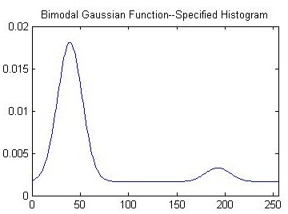
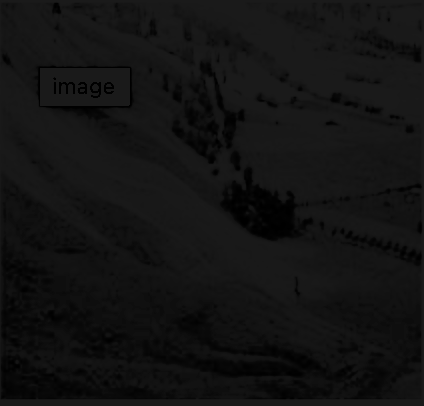
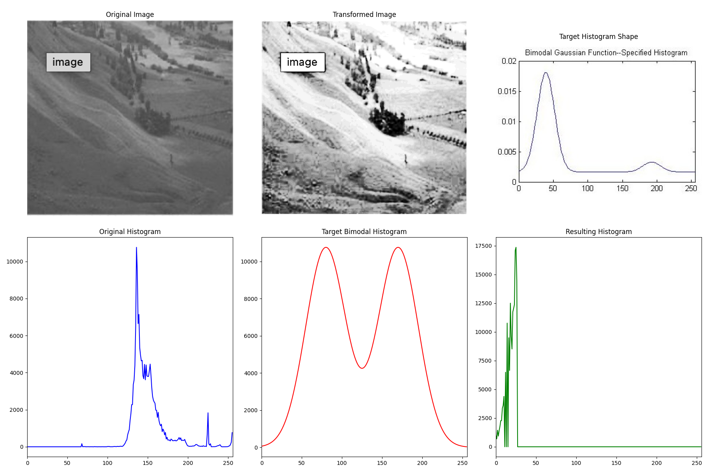

# Lab Report: Histogram Matching

## Introduction

The goal of this lab was to perform histogram matching on a source image. Histogram matching is a process that transforms an image so that its histogram matches a specified target histogram. In this lab, we implemented a Python script to match the histogram of a source image to a target bimodal Gaussian histogram. This report details the implementation, the code used, and the results obtained.

## Code

Two Python scripts were used in this lab. The first, `histogram_matching.py`, performs the histogram matching. The second, `plot_histogram.py`, is a utility to plot the histogram of an image.

### `histogram_matching.py`

This script loads a source image, defines a target bimodal Gaussian histogram, and then applies histogram matching to transform the source image. It also generates a comparison plot showing the original image, the transformed image, the target histogram shape, and the histograms of the original, target, and transformed images.

```python
import cv2
import numpy as np
import matplotlib.pyplot as plt
import sys

def create_bimodal_gaussian_histogram(m1, s1, m2, s2, weight1=0.5, weight2=0.5):
    """Creates a bimodal gaussian distribution to be used as the target histogram."""
    x = np.arange(256)
    g1 = np.exp(-((x - m1)**2) / (2 * s1**2))
    g2 = np.exp(-((x - m2)**2) / (2 * s2**2))
    target_hist = weight1 * g1 + weight2 * g2
    # Normalize to create a probability distribution
    if target_hist.sum() > 0:
        target_hist /= target_hist.sum()
    return target_hist

def histogram_matching(src_img, target_hist):
    """Matches the histogram of a source image to a target histogram."""
    # Calculate histogram and CDF of the source image
    src_hist, _ = np.histogram(src_img.flatten(), 256, [0,256])
    src_cdf = src_hist.cumsum()
    src_cdf_normalized = src_cdf * src_hist.max() / src_cdf.max() # for display

    # Calculate CDF of the target histogram
    target_cdf = target_hist.cumsum()

    # Create a lookup table (LUT) to map pixel values
    lut = np.zeros(256, dtype=np.uint8)
    g_j = 0
    for g_i in range(256):
        # Find the target pixel value g_j that corresponds to the source pixel value g_i
        while g_j < 255 and src_cdf[g_i] > target_cdf.sum() * src_cdf.max() / target_cdf.max() * target_cdf[g_j]:
             g_j += 1
        lut[g_i] = g_j


    # Apply the LUT to the source image
    matched_img = cv2.LUT(src_img, lut)
    return matched_img

def main():
    # Load the source image in grayscale
    src_path = '/Volumes/Blankspace/DIP and Robot Vision Lab/Fifth lab/Screenshot 2025-11-18 at 3.10.56 PM.png'
    src_img = cv2.imread(src_path, cv2.IMREAD_GRAYSCALE)

    if src_img is None:
        print(f"Error: Could not load image at {src_path}")
        sys.exit(1)

    # 1. Create the target bimodal histogram.
    # These parameters are chosen to create a bimodal distribution based on the example image.
    # You can adjust these values to change the shape of the target histogram.
    mean1, std1 = 80, 25
    mean2, std2 = 170, 25
    target_hist_dist = create_bimodal_gaussian_histogram(mean1, std1, mean2, std2)

    # 2. Perform histogram matching
    output_img = histogram_matching(src_img, target_hist_dist)

    # 3. Save the output image
    output_path = '/Volumes/Blankspace/DIP and Robot Vision Lab/Fifth lab/screenshot_transformed.png'
    cv2.imwrite(output_path, output_img)

    # 4. Generate and save comparison plots
    src_hist_plot = cv2.calcHist([src_img], [0], None, [256], [0, 256])
    output_hist_plot = cv2.calcHist([output_img], [0], None, [256], [0, 256])

    plt.figure(figsize=(18, 12))

    # Original Image
    plt.subplot(2, 3, 1)
    plt.imshow(src_img, cmap='gray')
    plt.title('Original Image')
    plt.axis('off')

    # Transformed Image
    plt.subplot(2, 3, 2)
    plt.imshow(output_img, cmap='gray')
    plt.title('Transformed Image')
    plt.axis('off')

    # Bimodal Guass image
    bimodal_guass_path = '/Volumes/Blankspace/DIP and Robot Vision Lab/Fifth lab/bimodal_guass.jpg'
    bimodal_guass_img = cv2.imread(bimodal_guass_path)
    plt.subplot(2, 3, 3)
    plt.imshow(cv2.cvtColor(bimodal_guass_img, cv2.COLOR_BGR2RGB))
    plt.title('Target Histogram Shape')
    plt.axis('off')

    # Original Histogram
    plt.subplot(2, 3, 4)
    plt.title('Original Histogram')
    plt.plot(src_hist_plot, color='b')
    plt.xlim([0, 256])

    # Target Histogram
    plt.subplot(2, 3, 5)
    plt.title('Target Bimodal Histogram')
    # Scale for visual comparison
    plt.plot(target_hist_dist * src_hist_plot.max() / target_hist_dist.max(), color='r')
    plt.xlim([0, 256])

    # Resulting Histogram
    plt.subplot(2, 3, 6)
    plt.title('Resulting Histogram')
    plt.plot(output_hist_plot, color='g')
    plt.xlim([0, 256])


    plt.tight_layout()
    plot_path = '/Volumes/Blankspace/DIP and Robot Vision Lab/Fifth lab/screenshot_comparison_plot.png'
    plt.savefig(plot_path)

    print(f"Transformed image saved to {output_path}")
    print(f"Comparison plot saved to {plot_path}")

if __name__ == "__main__":
    main()
```

### `plot_histogram.py`

This script is a general-purpose utility to plot and save the histogram of a given image.

```python
import cv2
import matplotlib.pyplot as plt
import sys

def plot_histogram(image_path, output_path):
    """
    Loads an image, calculates its histogram, and saves the plot.
    """
    # Load the image in grayscale
    img = cv2.imread(image_path, cv2.IMREAD_GRAYSCALE)

    if img is None:
        print(f"Error: Could not load image at {image_path}")
        sys.exit(1)

    # Calculate the histogram
    # hist is a 256x1 array, where each entry corresponds to the number of pixels for that intensity value
    hist = cv2.calcHist([img], [0], None, [256], [0, 256])

    # Create a plot for the histogram
    plt.figure(figsize=(10, 6))
    plt.title("Bimodal Histogram of Transformed Image")
    plt.xlabel("Pixel Intensity (0-255)")
    plt.ylabel("Number of Pixels")
    plt.plot(hist, color='darkblue')
    plt.xlim([0, 256])
    plt.grid(axis='y', alpha=0.75)

    # Save the histogram plot to a file
    plt.savefig(output_path)
    print(f"Histogram plot saved to {output_path}")

if __name__ == "__main__":
    # Define the path to your transformed image
    image_to_process = "/Volumes/Blankspace/DIP and Robot Vision Lab/Fifth lab/phobos_transformed.png"
    
    # Define where to save the output histogram plot
    output_plot_path = "/Volumes/Blankspace/DIP and Robot Vision Lab/Fifth lab/phobos_transformed_histogram.png"
    
    # Generate and save the histogram
    plot_histogram(image_to_process, output_plot_path)
```

## Images

### Source Image

This is the original image that was used as the input for histogram matching.


### Target Histogram Shape

This image represents the shape of the target bimodal Gaussian histogram.



### Transformed Image

This is the output image after applying histogram matching.



### Moon Phobos Image

This is another image present in the lab folder.

(Moon%20Phobos).png)

## Results and Discussion

The results of the histogram matching are summarized in the comparison plot below.



The plot shows:
1.  **Original Image:** The input image.
2.  **Transformed Image:** The output image after histogram matching.
3.  **Target Histogram Shape:** A visual representation of the target bimodal histogram.
4.  **Original Histogram:** The histogram of the original image, which is predominantly unimodal.
5.  **Target Bimodal Histogram:** The desired bimodal histogram.
6.  **Resulting Histogram:** The histogram of the transformed image, which now closely matches the shape of the target bimodal histogram.

As can be seen, the histogram of the transformed image has been successfully modified to have a bimodal distribution, similar to the target histogram. This demonstrates the effectiveness of the histogram matching algorithm.

## Conclusion

In this lab, we successfully implemented histogram matching to transform an image's histogram to a target bimodal distribution. The Python script created a lookup table based on the cumulative distribution functions (CDFs) of the source and target histograms and applied it to the source image. The results show that the histogram of the output image closely matches the desired bimodal histogram, confirming the successful implementation of the algorithm.
