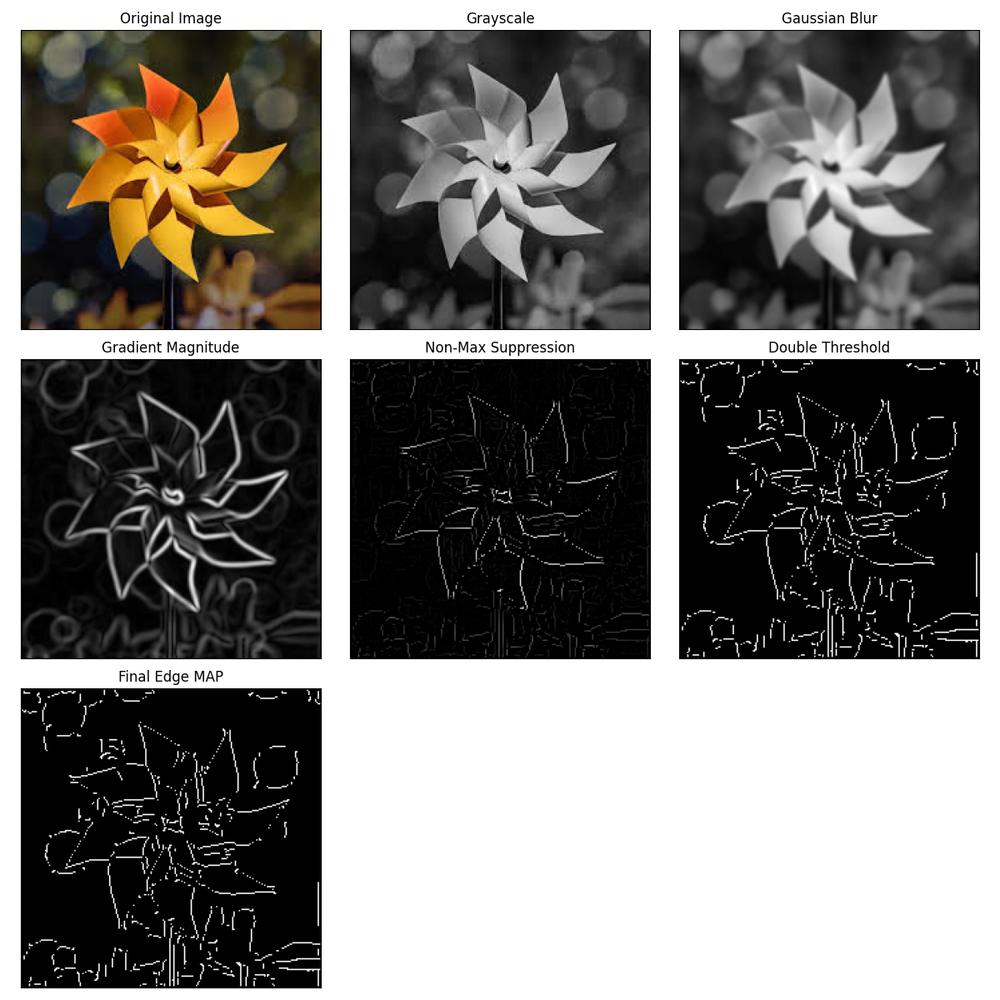
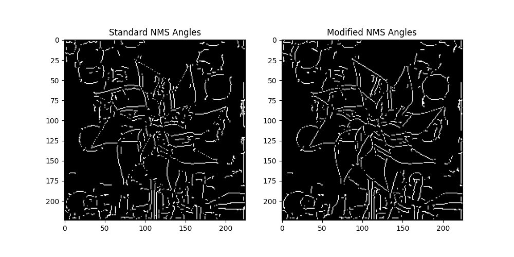
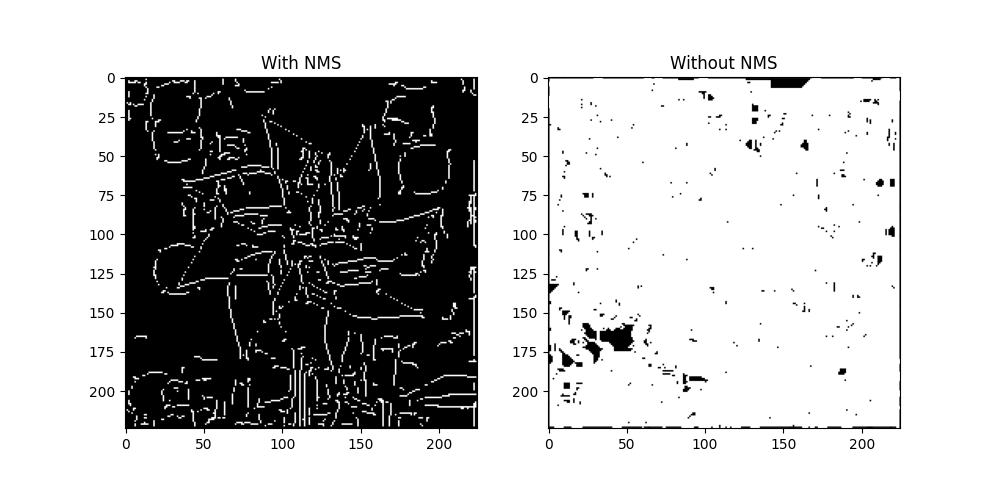
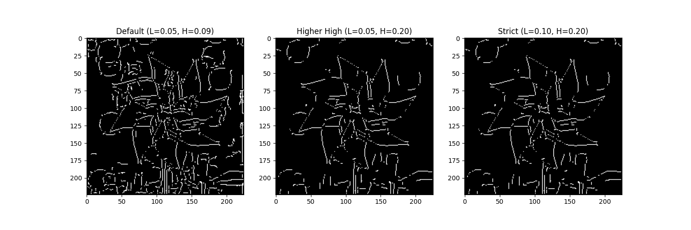

# Lab 8 Report: Canny Edge Detection Analysis

This report documents the implementation and analysis of the Canny Edge Detection algorithm and its modifications.

## Task 1: Canny implementation (Refactored)

The Canny Edge Detector was implemented using Python. While OpenCV's `cv2.GaussianBlur` and `cv2.Sobel` were used for pre-processing, the core logic for **Non-Maximum Suppression**, **Double Thresholding**, and **Hysteresis** was implemented manually.

### Stepwise Results
The following image shows the progression of the algorithm from the original image to the final edge map.

## Task 2: Advanced Modifications

### 2a. Changing Gradient Angle Bands
We modified the gradient angle quantization bins used in Non-Maximum Suppression. Typically, angles are quantized into 4 directions (0°, 45°, 90°, 135°).
By shifting these bins (e.g., rotating the quantization sectors), we observe how the edge thinning is affected.

**Observation**: Changing the angle bands can lead to broken edges or slightly displaced edge localizations, as the NMS checks neighboring pixels in directions that may no longer align perfectly with the true gradient normal.

### 2b. Skipping Non-Maximum Suppression
We tested the edge detector without the Non-Maximum Suppression step. The Gradient Magnitude is fed directly into the Double Thresholding stage.

**Observation**: Without NMS, the edges are **thick and blurry**. NMS is crucial for thinning the edges to a single pixel width, ensuring precise localization.

### 2c. Tuned Hysteresis Thresholds
We experimented with different high and low threshold ratios to find the best static values for the input image.

- **Default**: Low=0.05, High=0.09 (captures a lot of detail, perhaps some noise)
- **Higher High**: Low=0.05, High=0.20 (removes weak noise edges but keeps strong edges)
- **Strict**: Low=0.10, High=0.20 (cleanest main edges)

**Conclusion**: For this specific image, a stricter high threshold (e.g., 0.20) isolates the main object boundaries better, while the lower default threshold is better if texture detail is required.

## Task 3: Improving Speed of Canny Edge Detector

To improve the speed of the Canny Edge Detector, we can consider the following optimizations:

1.  **Fast Approximation of Gradient Magnitude**:
    Instead of calculating the exact Euclidean distance $\sqrt{I_x^2 + I_y^2}$, which involves expensive square root operations, we can use the $L_1$ norm approximation: $|I_x| + |I_y|$. This is significantly faster to compute on CPUs.

2.  **Vectorization and Parallelism**:
    The operations (Gaussian blur, Sobel, Gradient magnitude) are highly parallelizable. Using SIMD (Single Instruction, Multiple Data) instructions or GPU acceleration (CUDA/OpenCL) can massively speed up these pixel-wise operations. `cv2.Sobel` and `cv2.GaussianBlur` already utilize some of these optimizations.

3.  **Integral Images (for Blur)**:
    If a box filter is acceptable instead of a Gaussian filter, Integral Images allow for constant-time complexity blurring regardless of kernel size. However, for Canny, Gaussian is preferred for isotropy.

4.  **Separable Filters**:
    Gaussian Blur and Sobel operators are separable. A 2D convolution with an $N \times N$ kernel has complexity $O(N^2)$ per pixel. separating it into two 1D convolutions (horizontal then vertical) reduces complexity to $O(2N)$ per pixel.

5.  **Fixed-Point Arithmetic**:
    On embedded systems without FPUs, converting floating-point calculations to fixed-point integers can improve performance.
